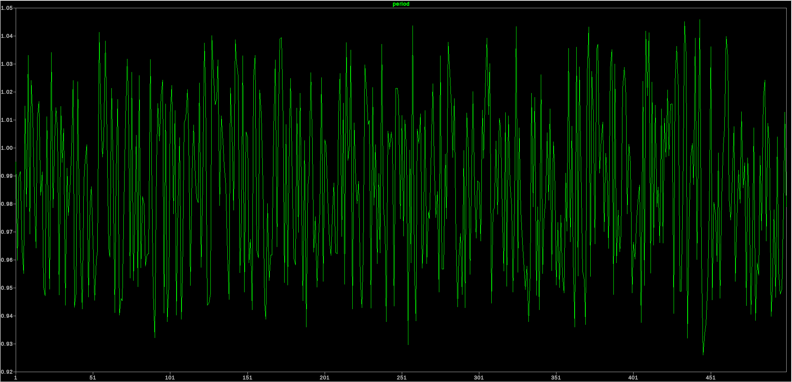

# MP1 – USB LED Flasher: Design Choices and Period Analysis

## 1. What the circuit does

The board plugs straight into a USB-A port. It takes the 5 V from USB, drops it to 3.3 V, and uses an op-amp wired up as an oscillator to blink a red LED once per second.

$$
\text{USB 5 V} \;\rightarrow\; \text{3.3 V regulator (U1)} \;\rightarrow\; \text{op-amp oscillator (U2)} \;\rightarrow\; \text{resistor + LED}
$$

Part names below are the ones on the KiCad schematic. (The LTspice sim uses slightly different names: sim R4 = KiCad R5, sim R5 = KiCad R4, sim C1 = KiCad C4.)

### What I had to work with

The assignment only allows parts from the provided parts list. That list has:

- one connector (a USB-A plug),
- one voltage regulator (MCP1702, fixed 3.3 V),
- two op-amps (MCP6021 single, MCP6022 dual – electrically the same),
- three LEDs (red, green, blue, all 0805),
- seven capacitor values (10 pF to 10 uF, all 0603),
- a set of 1% resistors from 10 Ohm to 10 M, all 0603.

So for a lot of the circuit there was really only one option, and "the choice" was about how to use the part rather than which part. Where there was an actual choice I say so.

### Why an op-amp oscillator

There is no 555 timer, microcontroller, or crystal on the list. The only active parts are the regulator and the op-amp, so the oscillator has to be built from the op-amp. The simplest op-amp oscillator is the relaxation oscillator (a Schmitt trigger with an RC on its input). It only needs one op-amp, one capacitor and a few resistors, its output is already a square wave that can drive an LED directly, and its period has a clean formula that only depends on the resistor and capacitor values. That makes the tolerance analysis straightforward.

## 2. Power supply

**J1 – Molex 48037-0001 USB-A plug.** This is the only connector on the list. It is a plug, not a socket, so the board goes into the computer directly like a USB stick, with no cable. Only the VBUS (5 V) and GND pins are used. D+ and D- are left unconnected: this board never talks to the computer, it only takes power. A USB port will give up to 100 mA to a device that never enumerates, and this circuit draws about 7 mA on average (about 1 mA for the op-amp plus 12 mA for the LED half of the time), so that is plenty.

**U1 – MCP1702 3.3 V regulator (LDO).** This is the only regulator on the list, and it is exactly what the assignment asks for: 3.3 V out from the 5 V USB input. It is a fixed 3.3 V part so it needs no setting resistors, and it can supply 250 mA, far more than this circuit uses.

**C1 (1 uF) and C3 (10 uF) – regulator capacitors.** The MCP1702 datasheet says it needs at least 1 uF of ceramic capacitance on both the input and the output to be stable. The list only has two caps that big: 1 uF and 10 uF. I used the 1 uF on the input (C1) and the 10 uF on the output (C3). The bigger one goes on the output because that is the side that feeds the whole 3.3 V rail, so it also acts as a bulk cap that supplies the 12 mA step each time the LED turns on. The input side is fed by the USB port, which already has a lot of capacitance behind it, so the minimum 1 uF is enough there.

**C5 (1 uF) – op-amp bypass cap.** A bypass cap right next to the op-amp supply pin keeps the supply clean when the output switches. The MCP6021 datasheet recommends 0.1 uF to 1 uF. I used the 1 uF rather than the 0.1 uF for two reasons: the op-amp output steps by 12 mA every time the LED turns on, and a bigger cap holds the supply pin steadier during that step, and the 0.1 uF is the tight-tolerance timing cap (see below), so I wanted to keep it for the timer only.

## 3. Oscillator

**U2 – MCP6021 op-amp.** The list has two op-amps: the MCP6021 (single, SOT-23-5) and the MCP6022 (dual, TSSOP-8). They are electrically the same. This circuit only needs one op-amp, so I picked the single one: the package is smaller, it is easier to route, and there is no unused second op-amp that would need its inputs tied off. Either one works for the oscillator because:

- it runs on a single 3.3 V supply,
- its output swings all the way from 0 V to 3.3 V ("rail-to-rail output"). The timing math in Section 6 assumes the output sits at the rails,
- its input bias current is about 1 pA. The timing capacitor is charged through a 3.01 M resistor, so the charging current is under 1 uA. The op-amp input current is about a million times smaller, so it does not affect the timing,
- its output can source or sink about 30 mA (short-circuit current), so it can drive the LED directly with no transistor. There is no transistor on the list anyway.

### How the oscillator works

1. R1 and R2 (both 4.99 k) divide 3.3 V in half to make a 1.65 V reference, $V_{mid}$. This is needed because the op-amp only has a single 3.3 V supply: there is no negative rail, so the circuit has to oscillate around the middle of the supply instead of around 0 V.
2. R3 (40.2 k) and R5 (20 k) connect the op-amp's + input to $V_{mid}$ and to the output. This gives the op-amp two switching thresholds, one above $V_{mid}$ and one below it (a Schmitt trigger).
3. R4 (3.01 M) and C4 (0.1 uF) are the timer. The output charges C4 through R4, and C4 is connected to the - input.
4. When the output is high (3.3 V), C4 charges up. When the voltage on C4 gets above the upper threshold, the op-amp flips and the output goes low (0 V).
5. Now C4 discharges through R4. When it gets below the lower threshold, the op-amp flips back to high.
6. Repeat forever. The output is a square wave and the LED blinks with it.

### Why these values

The parts list only has 1% resistors in a fixed set of values, and only a handful of capacitor values, so the values were picked to make 1 s out of what is available.

- **C4 = 0.1 uF.** The period is proportional to $R_4 C_4$, so the cap tolerance goes straight into the period. Looking at the list, the 0.1 uF is a 5% part, the 10 uF and 1 uF are 10%, and the 1 nF, 100 pF and 10 pF are 1% parts. The 1% caps are too small to use: 1 nF would need a 300 M resistor, and the biggest resistor on the list is 10 M. The 10% caps would blow the tolerance budget (Section 6.4). So the 0.1 uF 5% cap is the best-tolerance cap that gives a usable resistor value. 
- **R4 = 3.01 M.** With C4 = 0.1 uF, $R_4 C_4 = 0.301$ s, and the period works out to 1.00 s with the threshold resistors below. The list also has 2 M and 10 M. 10 M would need the thresholds to be within about 20 mV of the rails, which the op-amp cannot hold reliably. 2 M would work but needs the thresholds much closer to the rails than 3.01 M does. 3.01 M gave the cleanest match with values on the list and keeps the thresholds a comfortable 0.5 V away from the rails.
- **R3 = 40.2 k, R5 = 20 k.** These set how far apart the thresholds are. If they are set too close to the rails, the period becomes sensitive to exactly how close the op-amp output gets to the rails. If they are set too close to $V_{mid}$, the swing on the capacitor is small, so the op-amp's input offset (up to 0.5 mV) and noise start to matter, and a bigger $R_4 C_4$ is needed. The 2:1 ratio puts the thresholds at about 0.53 V and 2.77 V, roughly 0.5 V from each rail and 1.1 V from the middle, which is a good compromise. With this ratio the period comes out to 1.00 s (Section 6). Both values are on the list, and both are well above the 2.5 k that the divider adds in series with R3, so that extra 2.5 k is a small correction rather than a big one.
- **R1 = R2 = 4.99 k.** Equal values give exactly half the supply. That makes the two thresholds symmetric about the middle, so the charge and discharge halves take the same time and the LED is on for half the period (50% duty cycle). 4.99 k is low enough that the divider is "stiff" (R3 does not pull it around much), but high enough that it only wastes about 0.3 mA.
- **C4 goes to ground, not to $V_{mid}$.** Either works. Grounding it is simpler to route, and because the thresholds are symmetric about the middle it does not change the timing.

## 4. LED

**D1 (red LED) and R6 (110 Ohm).** The list has three 0805 LEDs (red, green, blue). I picked the red one (LTST-C171KRKT) because it has the lowest forward voltage, about 2 V. On a 3.3 V supply that leaves 1.3 V across the resistor, so it is the brightest option. The green and blue LEDs have a forward voltage around 3 V, which on a 3.3 V supply would only leave a few tenths of a volt for the resistor and give a few mA at best.

The LED is driven straight from the op-amp output through R6, with the anode toward the op-amp and the cathode to ground, so the LED is on when the output is high, for half of each period. The current is set by R6:

$$
I_{LED} = \frac{3.3\ \text{V} - V_f}{R_6} = \frac{3.3 - 2.0}{110} \approx 12\ \text{mA}
$$

I wanted around 10-15 mA: bright enough to see clearly, but with margin below both the LED's 20 mA rating and the op-amp's roughly 30 mA output limit. 110 Ohm is the value on the list that lands there (100 Ohm gives 13 mA, 127 Ohm gives 10 mA; any of them would be fine).

Loading the op-amp output with 12 mA pulls its high level a little below 3.3 V (on the order of 0.1-0.2 V). I checked what that does to the period: it lowers the upper threshold slightly, which makes the charge half a bit longer and the discharge half a bit shorter, and the two almost cancel. A 0.2 V drop changes the period by about +0.1% and the duty cycle from 50% to about 52%. So driving the LED directly from the output does not hurt the timing.

## 5. Simulation setup (LTspice)

The circuit was simulated in LTspice. There is no LTspice model for the MCP6021, so I used the built-in `UniversalOpAmp2` with a rail-to-rail output and a 3.3 V single supply. It captures what matters here, but is not the exact part, so the sim is a check on the math rather than a perfect prediction.

The sim starts with `.ic V(vn)=0` (capacitor empty) so it starts up the same way every run, and measures the period as the time between the second and third rising edges of the output. Skipping the first edge avoids the startup transient. The Monte Carlo run uses `.step param run 1 500 1` with `mc(value, 0.01)` on every resistor and `mc(0.1u, 0.05)` on C4, which are the real tolerances of the parts on the list.

## 6. Period analysis

### 6.1 Thresholds

The divider R1/R2 makes

$$
V_{mid} = 3.3\ \text{V} \cdot \frac{R_2}{R_1 + R_2} = 1.65\ \text{V}
$$

Looking back into the divider, its resistance is $R_1 \parallel R_2 = 2.5$ k. That 2.5 k is in series with R3, so the effective resistor from $V_{mid}$ to the + input is

$$
R_a = R_3 + R_1 \parallel R_2 = 40.2\ \text{k} + 2.5\ \text{k} = 42.7\ \text{k}
$$

The + input is a weighted average of $V_{mid}$ (through $R_a$) and the output (through $R_5$). When the output is at 3.3 V the upper threshold is

$$
V_{high} = \frac{V_{mid} R_5 + 3.3\ \text{V} \cdot R_a}{R_a + R_5}
        = \frac{1.65 \cdot 20\ \text{k} + 3.3 \cdot 42.7\ \text{k}}{62.7\ \text{k}} = 2.774\ \text{V}
$$

When the output is at 0 V the lower threshold is

$$
V_{low} = \frac{V_{mid} R_5}{R_a + R_5} = \frac{1.65 \cdot 20\ \text{k}}{62.7\ \text{k}} = 0.526\ \text{V}
$$

The thresholds are symmetric about 1.65 V ($1.65 \pm 1.124$ V).

### 6.2 Period

The time for C4 to charge from $V_{low}$ to $V_{high}$ while the output sits at 3.3 V is the usual RC charging formula:

$$
t_{up} = R_4 C_4 \ln\!\left(\frac{3.3 - V_{low}}{3.3 - V_{high}}\right)
       = 0.301\ \text{s} \cdot \ln\!\left(\frac{2.774}{0.526}\right)
       = 0.301 \cdot 1.662 = 0.500\ \text{s}
$$

Because the thresholds are symmetric about half the supply, the discharge time is the same:

$$
t_{down} = R_4 C_4 \ln\!\left(\frac{V_{high}}{V_{low}}\right) = 0.500\ \text{s}
$$

$$
T = t_{up} + t_{down} = 1.000\ \text{s}
$$

Written more compactly with $\beta = R_a/(R_a + R_5) = 0.681$:

$$
T = 2 R_4 C_4 \ln\!\left(\frac{1 + \beta}{1 - \beta}\right)
$$

(If you leave out the 2.5 k from the divider, $\beta$ drops to 0.668 and you get $T = 0.971$ s, so it is worth including.)

### 6.3 How much each part matters

Nudging each part by its tolerance and recomputing $T$:

| Part            | Change | Effect on $T$ |
|-----------------|--------|---------------|
| R4 (3.01 M)     | +1%   | +1.00%       |
| C4 (0.1 uF)     | +5%   | +5.00%       |
| R3 (40.2 k)     | +1%   | +0.46%       |
| R5 (20 k)       | +1%   | -0.48%       |
| R1 or R2        | +1%   | +0.01%       |

So the period is basically $R_4 C_4$ (1% of R4 or C4 = 1% of $T$), the threshold resistors matter about half as much, and the divider hardly matters at all because shifting $V_{mid}$ makes one half-cycle longer and the other shorter by the same amount.

The capacitor is the big one. The resistors are all 1% parts, so most of the error budget goes to the 5% cap. This is why picking the 5% 0.1 uF over a 10% cap mattered.

### 6.4 Worst case

Stack every tolerance in the worst direction (1% resistors, 5% cap):

- Everything pushing $T$ long: $T = 1.071$ s (+7.1%)
- Everything pushing $T$ short: $T = 0.932$ s (-6.8%)

Both are inside the $\pm 10$% spec, with about 3% of margin left.

### 6.6 Monte Carlo simulation (LTspice)

I ran the circuit in LTspice with `.step param run 1 500 1` and Monte Carlo tolerances on every part: `mc(value, 0.01)` on the resistors and `mc(0.1u, 0.05)` on C4. Each run measures the time between two rising edges of the output.

Results over 500 runs:

| Statistic          | Value     |
|--------------------|-----------|
| Mean period        | 0.987 s   |
| Std. deviation     | 0.030 s   |
| Minimum            | 0.926 s (-7.4%) |
| Maximum            | 1.046 s (+4.6%) |
| Runs inside 0.9-1.1 s | 500 / 500 |

The simulated mean (0.987 s) is about 1.4% under the hand calculation (1.000 s). The difference comes from the op-amp model: a real (or modelled) op-amp does not switch instantly and does not sit exactly on the rails, and the sim uses a generic op-amp model rather than the MCP6021. Either way, every run stayed inside the $\pm 10$% window, which matches the worst-case math above.

## 8. Bill of materials

All parts are from the provided parts list. 12 line items, 15 parts total. (Also provided as `MP1_BOM.csv`.)

| # | Ref | Qty | Value | Description | Manufacturer Part # | Digi-Key # | Tol. | Notes |
|---|---|---|---|---|---|---|---|---|
| 1 | J1 | 1 | 48037-0001 | CONN PLUG USB 4POS RT ANG PCB | 0480370001 | WM17117-ND |  | USB-A plug; only VBUS and GND used |
| 2 | U1 | 1 | MCP1702T-3302E/CB | IC REG LIN 3.3V 250MA SOT23A-3 | MCP1702T-3302E/CB | MCP1702T-3302E/CBCT-ND |  | 3.3 V LDO regulator |
| 3 | U2 | 1 | MCP6021T-E/OT | IC OPAMP GP 10MHZ RRO SOT23-5 | MCP6021T-E/OT | MCP6021T-E/OTCT-ND |  | Rail-to-rail op-amp (oscillator) |
| 4 | D1 | 1 | LED | LED RED CLEAR 0805 SMD | LTST-C171KRKT | 160-1427-1-ND |  | Red LED |
| 5 | C1,C5 | 2 | 1u | CAP CER 1UF 25V X7R 0603 | C0603C105K3RACTU | 399-7376-1-ND | 10% | C1 = LDO input cap; C5 = op-amp bypass |
| 6 | C3 | 1 | 10u | CAP CER 10UF 16V X5R 0603 | GRT188R61C106KE13D | 490-12317-1-ND | 10% | LDO output / bulk cap |
| 7 | C4 | 1 | 0.1u | CAP CER 0.1UF 50V X7R 0603 | CC0603JRX7R9BB104 | 311-1779-1-ND | 5% | Timing capacitor |
| 8 | R1,R2 | 2 | 4.99k | RES SMD 4.99K OHM 1% 1/10W 0603 | RC0603FR-074K99L | 311-4.99KHRCT-ND | 1% | Mid-rail divider |
| 9 | R3 | 1 | 40.2k | RES SMD 40.2K OHM 1% 1/10W 0603 | RC0603FR-0740K2L | 311-40.2KHRCT-ND | 1% | Threshold resistor |
| 10 | R4 | 1 | 3.01M | RES SMD 3.01M OHM 1% 1/10W 0603 | RC0603FR-073M01L | 311-3.01MHRCT-ND | 1% | Timing resistor |
| 11 | R5 | 1 | 20k | RES SMD 20K OHM 1% 1/10W 0603 | RC0603FR-0720KL | 311-20.0KHRCT-ND | 1% | Threshold / positive feedback resistor |
| 12 | R6 | 1 | 110 | RES SMD 110 OHM 1% 1/10W 0603 | RC0603FR-07110RL | 311-110HRCT-ND | 1% | LED current-limit resistor |

## 9. Summary

- The circuit meets the 1 s $\pm 10$% spec: 1.000 s by hand, worst case -6.8% / +7.1% with the real part tolerances, and 500 of 500 Monte Carlo runs inside the window.
- It runs on 3.3 V made from USB 5 V by the only regulator on the list, with the bypass and bulk caps the datasheets ask for.
- Every part is from the parts list. Most of them were the only option; the real choices were the timing values, the threshold ratio, the single vs. dual op-amp, and the LED colour.
- The PCB is a two-layer, all-top-side, 16.1 x 14.0 mm board with a solid ground plane, 20 mil power and 8 mil signal traces, no vias in pads, and a clean DRC.

## 10. Project files

All KiCad design files, the custom symbol/footprint library, the LTspice simulation, this report and the BOM are at:

https://github.com/Dh-Van/eclectronics-mp1
